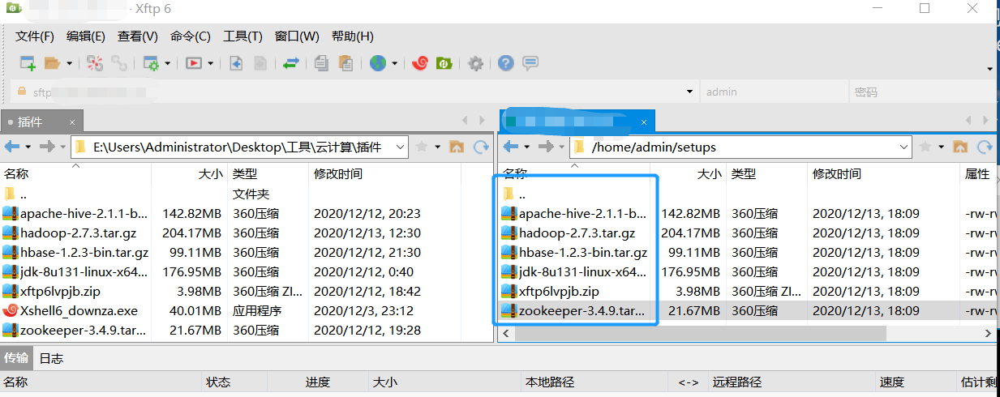
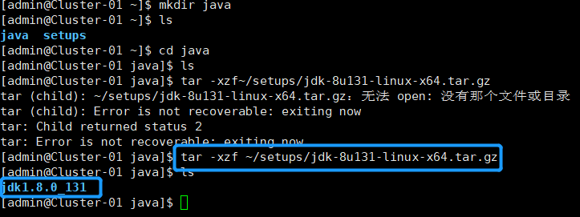

<!-- ## 背景

Linux一开始出现是在学OS这门课的时候，当时学习热情不高，对于作业的完成度仅仅到能重现老师所给的指导文档。自己却是没真正去学习那个重点，也缺乏OS相关书籍的积累。

现在的一门云计算期末考核，一部分成绩是技术实操，所以该填的坑还是要填的。。。 -->

# 目录

- [目录](#目录)
  - [环境配置](#环境配置)
  - [云计算实验：Zookeeper+Hadoop+Hbase整合平台搭建](#云计算实验zookeeperhadoophbase整合平台搭建)
    - [配置五台虚拟机](#配置五台虚拟机)
      - [1. 名字连续](#1-名字连续)
      - [2. 虚拟机配置统一](#2-虚拟机配置统一)
      - [3. 创建新用户admin](#3-创建新用户admin)
      - [4. 配置虚拟机网卡：](#4-配置虚拟机网卡)
      - [4. 免密码登录配置(全程admin)：](#4-免密码登录配置全程admin)
      - [5.为虚拟机配置jdk](#5为虚拟机配置jdk)
      - [zookeeper(以下简称zoo)的解压和配置](#zookeeper以下简称zoo的解压和配置)
      - [hadoop的安装和配置：](#hadoop的安装和配置)
  - [相关操作](#相关操作)
      - [1. 切换当前用户(假设当前用户为root)：](#1-切换当前用户假设当前用户为root)
      - [2. 挂载光盘：](#2-挂载光盘)
      - [3. 卸载光盘：](#3-卸载光盘)
      - [4. Linux系统中远程传输文件](#4-linux系统中远程传输文件)
  - [FAQ](#faq)
    - [进入linux系统后，想移除到win界面移不出来：](#进入linux系统后想移除到win界面移不出来)
    - [如何把已创建的文件复制到另一路径下：](#如何把已创建的文件复制到另一路径下)
    - [输入ifconfig无反应：](#输入ifconfig无反应)
    - [传输文件出现错误或常见no route to host：](#传输文件出现错误或常见no-route-to-host)
    - [linux中查看IP地址：](#linux中查看ip地址)
      - [ping www.baidu.com失败，linux上不了网：](#ping-wwwbaiducom失败linux上不了网)
      - [在关闭防火墙到时候，出现：](#在关闭防火墙到时候出现)
      - [清除秘钥方式](#清除秘钥方式)


## 环境配置

`VMware Workstation/Oracle VM VirtualBox`

`CentOS7`


## 云计算实验：Zookeeper+Hadoop+Hbase整合平台搭建

### 配置五台虚拟机


#### 1. 名字连续

#### 2. 虚拟机配置统一

* **内存：**`2G(1G也可)`

* **操作系统：**`Red Hat（64-bit）      `

* **光驱：**`CentOS-7-x86_64-DVD-1708.iso`(不能是Mini/精简版)

* **硬盘容量：**`8GB（500MB以上也可）`

如果不知道虚拟机的具体安装步骤，请看参考教程：https://gitee.com/aroming/course_os/blob/master/Experiments/Expt_Guides/OS-E01_Guide/OS-E01_guide.md#%E5%AE%9E%E9%AA%8C%E5%86%85%E5%AE%B9%E6%8C%87%E5%BC%95

#### 3. 创建新用户admin

```
useradd admin
passwd admin
```

#### 4. 配置虚拟机网卡：

**1.查看网卡状态：**

```
ifconfig（可能找不到命令，跳过）

cd /etc/sysconfig/network-scripts,cat ifcfg-enp0s3(网卡根据自己的,如enp0s3)

vi ifcfg-ens33
```


**2.修改文件内容为如下（有则修改，无则添加）：**

```
BOOTPROTO=static  
NM_CONTROLLED=no
ONBOOT=yes
IPADDR=192.168.10.111（该IPADDR前三部分要匹配自己电脑）
NATMASK=255.255.255.0 
GATEWAY=192.168.10.1
```

<font size="3" color=red >192.168.10要根据电脑设置，进入电脑cmd输入ipconfig，然后查看当前网络的IPv4地址和默认网关 比如为192.168.10，那么你的虚拟机IP就要设置为192.168.10.xxx，默认网关则都要一致 </font>

**保存退出，Esc，:wq**

**3.重启网卡服务，并测试能否ping通：**
```
service network restart

ping 192.168.10.111(根据自己刚才设置的IP)
```

可以ping通代表网卡配置完成。

<font size="3" color=red>另：如果虚拟机要连接其他主机，需要修改网卡为桥接模式,并选择正确桥接网卡name</font>

**4. 配置主机名(重启生效)**

```
cd /etc/

vi hostname

把原来的一行直接删掉，
在末尾添加修改后的主机名Cluster-01(根据所在主机配置)

reboot
```


**5. 配置防火墙（可跳过）**

```
firewall-cmd --zone=public --add-port=端口号/tcp --permanent

firewall-cmd --reload
```

关闭防火墙（了解即可，实际操作请勿关闭防火墙）：

```
systemctl　stop　firewalld.service  #关闭防火墙服务

systemctl　disable　firewalld.service  #禁止防火墙服务的开机自动启动

systemctl　status　firewalld.service  #验证是否关闭
```

Zookeeper的常用端口：2181、2888、3888。
Hadoop的常用端口：8019、8020、8030、8031、8032、8033、8040、8041、8042、8088、8480、8485、9000、10020、19888、50010、50020、50070、50075、50470、50475。
HBase的常用端口：2181、2888、3888、60000、60010、60020、60030。HBase的常用端口和Zookeeper有重复是因为HBase自带Zookeeper组件，使用独立Zookeeper时这些端口不会被启用，也就不会造成端口冲突。
Hive的常用端口：9083、10000。
MySQL Cluster的常用端口：1186、2202、3306。


6. 将hosts发给其他主机：

**在root@C1 ~下：**

**修改root的C1 hosts：**

```
cd /etc
vi hosts
```

C1的hosts的内容如下，一般只需在其后添加各主机ip 主机服务器名:

```
127.0.0.1   localhost localhost.localdomain localhost4 localhost4.localdomain4
::1         localhost localhost.localdomain localhost6 localhost6.localdomain6
192.168.120.111    Cluster-01
192.168.120.112    Cluster-02
192.168.120.113	   Cluster-03
192.168.120.114	   Cluster-04
192.168.120.115	   Cluster-05
```

`#scp -r /etc/hosts root@192.168.10.112:/etc`

#### 4. 免密码登录配置(全程admin)：

**1. 新建用于集群的admin用户，每台主机都建一个（已有则跳过）**

```
useradd admin
passwd admin 
```

**2. 免密码设置**

**生成当前登录用户的公钥和私钥文件**

在admin@Cluster-01中:

```
$ ssh-keygen -t rsa
```

**查看是否已有ssh（确定已有可跳过）**
```
$ l.

$ cd .ssh

$ ls
```

**将公钥文件拷贝给需要进行免密码登录的目标主机和目标用户**

（前提是已把hosts发给目标主机）`#scp -r /etc/hosts root@192.168.10.112:/etc`

**$ ssh-copy-id -i ~/.ssh/id_rsa.pub admin@Cluster-02**

**3. 验证免密码登录：**

在root@Cluster-01中:

**ssh admin@Cluster-02**

如果没有提示让你输入Cluster-02的
admin用户的密码，则说明配置正确。

#### 5.为虚拟机配置jdk

* 所需文件：jdk-8u131-linux-x64.tar.gz

前提：卸载原有JDK(每台主机)

``` 
rpm-qa |grep java（搜索已装的JDK）

rpm-qa |grep jdk

rpm -e 软件包名（删除已安装的JDK）

yum remove 软件名（删除关联的依赖软件包）
```

<!-- 1. 把如图文件从本机移动到主机1中：

 -->

1. 在admin@Cluster1 ~(以下简称为C1)目录(可用命令`cd ~`进入)中：

```
cd setups 

ls
```

2. 在admin@C1 ~ 中：

```
mkdir java

ls

cd java

tar -xzf ~/setups/jdk-8u131-linux-x64.tar.gz

ls
```
<!-- 
如图：

 -->

3. admin@C1 java :

```vi ~/.bash_profile```

在其尾部添加：

```
#javaenvironment
JAVA_HOME=/home/admin/java/jdk1.8.0_131
CLASSPATH=.:$JAVA_HOME/lib/tools.jar:$JAVA_HOME/lib/dt.jar
PATH=$JAVA_HOME/bin:$PATH
export JAVA_HOME CLASSPATH PATH
```

source ~/.bash_profile（使得环境变量即刻生效）

4. 检查环境变量是否正确并验证JDK的安装配置（确定已装可跳过）

```
echo $JAVA_HOME
echo $CLASSPATH
echo $PATH
java-version
javac-version
```

5. 同步JDK的安装和配置：

在admin@C1 中：

```
scp -r ~/java ~/.bash_profile admin@Cluster-02:/home/admin（将java目录和.bash_profile发送给集群中其他主机）

source ~/.bash_profile（然后每台主机执行该语句，使得环境变量生效）
```

* 验证其他主机的环境变量是否生效：返回上一个5. 检查环境变量是否正确并验证JDK的安装配置

#### zookeeper(以下简称zoo)的解压和配置

* 所需文件：zookeeper-3.4.9.tar.gz(用xftp放在setups里面)

1. 在admin@C1 ~(以下都是admin@C1,除非特指root)下:

```
mkdir ~/zookeeper

cd ~/zookeeper

tar -xzf ~/setups/zookeeper-3.4.9.tar.gz

ls(查看是否有~/zookeeper/zookeeper-3.4.9)
```

2. 为c1配置zoo环境变量：

* 对配置文件进行修改，在文件末尾添加以下内容：

```
vi ~/.bash_profile

#zookeeper environment
ZOOKEEPER_HOME=/home/admin/zookeeper/zookeeper-3.4.9
PATH=$ZOOKEEPER_HOME/bin:$PATH
export ZOOKEEPER_HOME PATH
```


3. 使环境生效，验证c1是否成功配置zoo环境变量：

```
source ~/.bash_profile
echo $ZOOKEEPER_HOME
echo $PATH
```

4.  修改配置文件zoo.cfg：

`vi zoo.cfg`

**以下有则改之，无则在配置文件末尾添加**

```
dataDir=/home/admin/zookeeper/data
dataLogDir=/home/admin/zookeeper/logs
server.1=Cluster-01:2888:3888
server.2=Cluster-02:2888:3888
server.3=Cluster-03:2888:3888
server.4=Cluster-04:2888:3888
server.5=Cluster-05:2888:3888
```

5. C1复制一份zoo_cfg为zoo_sample.cfg：

```
mkdir data logs
ls

cd zookeeper-3.4.9/conf
cp zoo_sample.cfg zoo.cfg
ls
```

6. (root下)分别在每台主机上添加防火墙,其端口号为2888,然后重启(已添加可跳过)：

```
su root

firewall-cmd --zone=public --add-port=2888/tcp --permanent
firewall-cmd --reload
```
**如果都是success则成功，进入下一步。**

7. 同步安装和配置：

**发送zoo目录和.bash_profile文件给集群中其他主机(2-5)**

**在主机一上进行传输：**
```
scp -r ~/zookeeper ~/.bash_profile admin@Cluster-02:/home/admin
```
**在其他主机上验证是否生效：**

```
source ~/.bash_profile
echo $ZOOKEEPER_HOME
echo $PATH
```

8. 配置Zookeeper节点标识文件

在admin@C1 ~下：

`$echo '1'  > ~/zookeeper/data/myid`

9. zoo完全分布模式启动和验证：

操作前，关闭所有防火墙(所有主机，root下)

```
systemctl stop firewalld.service
systemctl disable firewalld.service
```

10. 所有主机启动zoo服务，显示STARTED表示成功：

`zkServer.sh start`

11. 在所有主机上执行jps,查看java进程信息，若有`QuorumPeerMain`表示zoo启动成功:

`jps`

12. 查看每台主机的zoo状态,若只有一个`leader`，其余都是`follower`表示已成功：

`zkServer.sh status`

若防火墙未关闭，则出现Error contacting service. It is probably not running.。(关闭详见zoo/9.)

13. 利用zoo的命令行连接zoo集群，*表示节点编号，可连接任何节点：

`zkCli.sh -server Cluster-*:2181`
显示CONNECTED表示连接正常，quit可以退出。


#### hadoop的安装和配置：

* 所需文件：hadoop-2.7.3.tar.gz(用xftp放在setups里面)

**如果没特指，以下都是在admin@C1下进行**

1. 创建hadoop(以下简称hd)文件夹，解压相应hd的压缩文件：

```
mkdir hadoop 
ls

cd hadoop/
ls
tar -xzf ~/setups/hadoop-2.7.3.tar.gz
ls
```

2. 配置hd相关环境变量并验证是否生效：

```
vi ~/.bash_profile
对配置文件进行修改，在文件末尾添加以下内容：
#hadoop environment
HADOOP_HOME=/home/admin/hadoop/hadoop-2.7.3
PATH=$HADOOP_HOME/bin:$HADOOP_HOME/sbin:$PATH
export HADOOP_HOME PATH
```

```
source ~/.bash_profile
echo $HADOOP_HOME
echo $PATH
hadoop version 
```

3. 分布模式配置:

```
cd ~/hadoop

mkdir tmp name data journal
```

4. 修改hd配置文件：

```
cd ~/hadoop/hadoop-2.7.3/etc/hadoop
vi hadoop-env.sh
```

找到配置项为JAVA_HOME所在行，修改为：

`export JAVA_HOME=/home/admin/java/jdk1.8.0_131`

**路径以实际解压位置路径为准**

5. 修改配置文件：

`vi core-site.xml`

内容如下：
<configuration>
<property>
<name>fs.defaultFS</name>
<value>hdfs://hadoop-ha</value>
</property>

<property>
<name>hadoop.tmp.dir</name>
<value>/home/admin/hadoop/tmp</value>
</property>

<property>
<name>ha.zookeeper.quorum</name>
<value>Cluster-01:2181,Cluster-02:2181,Cluster-03:2181,Cluster-04:2181,Cluster-05:2181</value>
</property>
</configuration>

`vi hdfs-site.xml`

内容如下：
<configuration>
<property>
<name>dfs.nameservices</name>
<value>hadoop-ha</value>
</property>
<property>
<name>dfs.ha.namenodes.hadoop-ha</name>
<value>name-1,name-2</value>
</property>
<property>
<name>dfs.namenode.rpc-address.hadoop-ha.name-1</name>
<value>Cluster-01:9000</value>
</property>
<property>
<name>dfs.namenode.http-address.hadoop-ha.name-1</name>
<value>Cluster-01:50070</value>
</property>
<property>
<name>dfs.namenode.rpc-address.hadoop-ha.name-2</name>
<value>Cluster-02:9000</value>
</property>
<property>
<name>dfs.namenode.http-address.hadoop-ha.name-2</name>
<value>Cluster-02:50070</value>
</property>
<property>
<name>dfs.namenode.shared.edits.dir</name>
<value>qjournal://Cluster-03:8485;Cluster-04:8485;Cluster-05:8485/hadoop-ha</value>
</property>
<property>
<name>dfs.journalnode.edits.dir</name>
<value>/home/admin/hadoop/journal</value>
</property>
<property>
<name>dfs.ha.automatic-failover.enabled</name>
<value>true</value>
</property>
<property>
<name>dfs.client.failover.proxy.provider.hadoop-ha</name>
<value>org.apache.hadoop.hdfs.server.namenode.ha.ConfiguredFailoverProxyProvider</value>
</property>
<property>
<name>dfs.ha.fencing.methods</name>
<value>
sshfence
shell(/bin/true)
</value>
</property>
<property>
<name>dfs.ha.fencing.ssh.private-key-files</name>
<value>/home/admin/.ssh/id_rsa</value>
</property>
<property>
<name>dfs.ha.fencing.ssh.connect-timeout</name>
<value>30000</value>
</property>
<property>
<name>dfs.namenode.name.dir</name>
<value>/home/admin/hadoop/name</value>
</property>
<property>
<name>dfs.datanode.data.dir</name>
<value>/home/admin/hadoop/data</value>
</property>
<property>
<name>dfs.replication</name>
<value>3</value>
</property>
</configuration>

```
cp mapred-site.xml template mapred-site.xml
vi mapred-site.xml
```
修改内容如下：

<configuration>
<property>
<name>mapreduce.framework.name</name>
<value>yarn</value>
</property>
</configuration>

`vi yarn-env.sh`

找到JAVA_HOME所在行，改为：
`export JAVA_HOME=/home/admin/java/jdk1.8.0_131`

`vi yarn-site.xml`

修改内容如下：

<configuration>
<!-- Site specific YARN congfiguration proerties -->
<property>
<name>yarn.resourcemanager.ha.enabled</name>
<value>true</value>
</property>
<property>
<name>yarn.resourcemanager.cluster-id</name>
<value>yarn-ha</value>
</property>
<property>
<name>yarn.resourcemanager.ha.rm-ids</name>
<value>resource-1,resource-2</value>
</property>
<property>
<name>yarn.resourcemanager.hostname.resource-1</name>
<value>Cluster-01</value>
</property>
<property>
<name>yarn.resourcemanager.hostname.resource-2</name>
<value>Cluster-02</value>
</property>
<property>
<name>yarn.resourcemanager.zk-address</name>
<value>Cluster-01:2181,Cluster-02:2181,Cluster-03:2181,Cluster-04:2181,Cluster-05:2181</value>
</property>
<property>
<name>yarn.nodemanager.aux-services</name>
<value>mapreduce_shuffle</value>
</property>
</configuration>

`vi slaves`

删除原有所有内容，添加集群所有数据节点：

```
Cluster-03
Cluster-04
Cluster-05
```

6. 将hadoop目录和.bash_profile发给集群其他主机：

```
scp -r ~/hadoop ~/.bash_profile admin@Cluster-02:/home/admin 
```

7. 在每台主机上验证hd环境变量是否生效：

```
source ~/.bash_profile
echo $HADOOP_HOME
echo $PATH
hadoop version
```

8. 在所有同步通信节点(C3-5)上执行，启动该服务(安装完仅一次)：

`hadoop-daemon.sh start journalnode`

在所有通信节点查看：
```
jps
```
若有JournalNode表示成功。

9. 格式化HDFS(安装完仅一次)：

`hadoop namenode -format`


10. 将hadoop目录下的`name`目录发给集群所有备用主节点(这里只有C2)：

```
scp -r ~/hadoop/name admin@Cluster-02:/home/admin/hadoop
```

11. 在每台主机上查看zoo状态：

`zkServer.sh status`

没有出现follower或leader则重启:

`zkServer.sh start`

12. 对主节点切换控制信息进行格式化(仅一次)：

`hdfs zkfc -formatZK`

13. 在所有同步通信节点的主机：

`hadoop-daemon.sh stop journalnode`

14. 启动zoo集群：

主节点(C1):
`start-all.sh`

备用主节点(C2)：
`yarn-daemon.sh start resourcemanager`

15. 在主节点使用jps，若有`NameNode`、`ResourceManager`、`DFSZKFailoverController`的三个进程表示成功

`jps`

可以使用命令hadoop dfsadmin -report 查看HDFS状态。

16. 在其他主机上使用jps查看：

方法1：`ssh 目标主机或IP地址`
方法2：`xsheel中开启多台主机，jps直接查看`

备用主节点(C2)若有`NameNode`、`ResourceManager`、`DFSZKFailoverController`的三个进程表示成功

其他节点(C2-C5)若有`NameNode`、`ResourceManager`、`JournalNode`表示成功

17. hd登录自己目录并查看文件：

```
hadoop fs -mkdir -p /user/admin
hadoop fs -ls -R /
```

```
cd ~/hadoop/hadoop-2.7.3/share/hadoop/mapreduce
hadoop jar hadoop-mapreduce-examples-2.7.3.jar pi 2 1000
```


## 相关操作

#### 1. 切换当前用户(假设当前用户为root)：

`su admin`

#### 2. 挂载光盘：

```
mkdir　~/cdrom

sudo　mount　-r　/dev/cdrom　~/cdrom
```

**报错：**`no medium found on /dev/sr0`

**解决方法：**在linux最下面一栏的光驱右击一下，选择已有的`centos`即可。如图左二：


#### 3. 卸载光盘：

```
sudo　umount　-v　/dev/cdrom
或
sudo　umount　-v　~/cdrom
```

#### 4. Linux系统中远程传输文件

scp  -r   /home/admin/要传输的文件  root@IP地址/home/


## FAQ

### 进入linux系统后，想移除到win界面移不出来：
      
      界面右下角有提示，照着按即可退出。

### 如何把已创建的文件复制到另一路径下：

      sudo cp test.txt dir/test.txt

### 输入ifconfig无反应：
    
      1. 先确认一下是否缺少了ifconfig
            cd /sbin 
            ls

      2.如果确实，安装（sudo只有root可以运行）：
            (sudo) yum install net-tools 
   
      3.如果没网络下载不了，检查网卡是否配置为dhcp，最好是dhcp（linux自动配置），然后重启一下即可

### 传输文件出现错误或常见no route to host：

检查每台机器是否网卡配置正确并且都为桥接模式
各主机/etc/hosts应该一致，并都有全部主机的IP
各主机的IP设置正确。

### linux中查看IP地址：

```
ip addr
或
vi etc/config/network-scripts/ifcfg-enp0s3
```
#### ping www.baidu.com失败，linux上不了网：

[root@localhost ~]# ping www.baidu.com
ping: www.baidu.com: Name or service not known

**检查网卡设置是否正确:**

        1.可以查看网卡是否启动、IP地址是否存在：ip addr
        如果有enp0s3和inet 地址...代表网卡配置成功，可
        service network start
      
        2.修改网卡配置BOOTPROTO为dhcp（自动分配），如果为static，则ping不通。

#### 在关闭防火墙到时候，出现：

`
Redirecting to /bin/systemctl stop  iptables.service
Failed to stop iptables.service: Unit iptables.service not loaded.`

解决方法：

    yum install iptables-services

#### 清除秘钥方式

    ssh-keygen -R 接目标地址  即可清除秘钥文件


<!-- #### sudo执行命令时提示找不到该命令

1、切换到root用户， 以root用户身份来编辑文件/etc/sudoers：

vim /etc/sudoers
1
找到Defaults env_reset, 将其改为Defaults !env_reset，
然后wq!强制保存退出。
2、 切换回普通用户如用户名为xx, 编辑/etc目录下的配置文件bashrc：

vim bashrc
1
在文件内最后追加：

alias sudo='sudo env PATH=$PATH'
1
是修改后的配置文件生效：

source bashrc

参考自https://blog.csdn.net/panchang199266/article/details/81543335


可以使用 ssh-keygen -R 接目标地址  即可清除秘钥文件

[参考资料](https://blog.csdn.net/zhou_438/article/details/86761398)
      -->